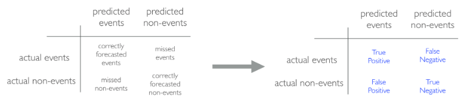
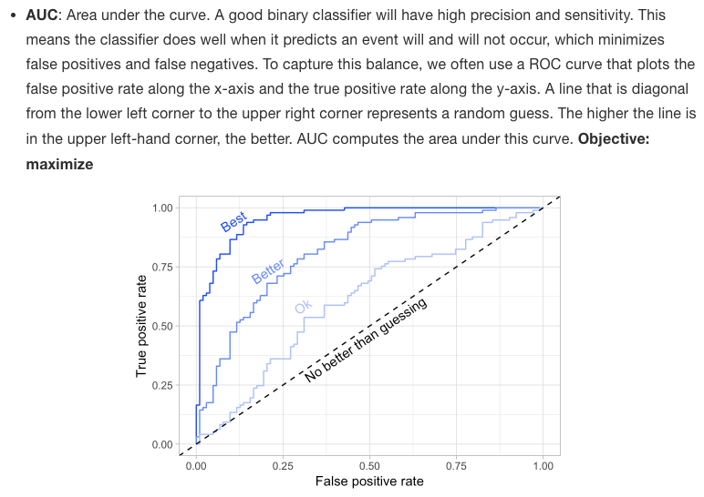

```{r setup, include=FALSE}
knitr::opts_chunk$set(echo = TRUE)
library(caret)
library(dplyr)
library(ggplot2)
library(h2o)
library(rsample)
h2o.no_progress()  #turn off progress bars 
h2o.init() #launch h2o
```


```{r}
ames <- AmesHousing::make_ames()
ames.h2o <- as.h2o(ames)

churn <- rsample::attrition %>% 
  mutate_if(is.ordered, factor, ordered = FALSE)
churn.h2o <- as.h2o(churn)
```


## Resampling methods 

### k-fold cross validataion 


k-fold cross-validation (aka k-fold CV) is a resampling method that randomly divides the training data into k groups (aka folds) of approximately equal size. 


```{r}
h2o.cv <- h2o.glm(
  x = c("Year_Sold", "Longitude", "Latitude"), 
  y = "Sale_Price", 
  training_frame = ames.h2o,
  nfolds = 10  # perform 10-fold CV
)
```


### Bootstrapping 


A bootstrap sample is a random sample of the data taken with replacement

```{r}
bootstraps(ames, times = 10)
```

## Bias variance trade-off

### Bias 

Bias is the difference between the expected (or average) prediction of our model and the correct value which we are trying to predict. It measures how far off in general a model’s predictions are from the correct value, which provides a sense of how well a model can conform to the underlying structure of the data.


### Variance 

Error due to variance is defined as the variability of a model prediction for a given data point.

### Hyperparameter tuning

Hyperparameters (aka tuning parameters) are the “knobs to twiddle”6 to control the complexity of machine learning algorithms and, therefore, the bias-variance trade-off. 


## Model evaluation 


### Regression models

- **MSE**: Mean squared error is the average of the squared error The squared component results in larger errors having larger penalties. 
  - Objective: minimize
- **RMSE**: Root mean squared error. This simply takes the square root of the MSE metric so that your error is in the same units as your response variable. If your response variable units are dollars, the units of MSE are dollars-squared, but the RMSE will be in dollars. 
  - Objective: minimize
- **Deviance**: Short for mean residual deviance. In essence, it provides a degree to which a model explains the variation in a set of data when using maximum likelihood estimation. If the response variable distribution is Gaussian, then it will be approximately equal to MSE. When not, it usually gives a more useful estimate of error
  - Objective: minimize
- **MAE**: Mean absolute error. Similar to MSE but rather than squaring, it just takes the mean absolute difference between the actual and predicted values 
  - Objective: minimize
- **RMSLE**: Root mean squared logarithmic error. 
  - Objective: minimize
- **R^2**: This is a popular metric that represents the proportion of the variance in the dependent variable that is predictable from the independent variable(s). 
  - Objective: maximize


### Classification models

- **Misclassification**: This is the overall error.
  - Objective: minimize
- **Mean per class error**:  This is the average error rate for each class
  - Objective: minimize
- **MSE**: Mean squared error. Computes the distance from 1.0 to the probability suggested. 
  - Objective: minimize
- **Cross-entropy (aka Log Loss or Deviance)**: Similar to MSE but it incorporates a log of the predicted probability multiplied by the true class
  - Objective: minimize
- **Gini index**: Mainly used with tree-based methods and commonly referred to as a measure of purity where a small value indicates that a node contains predominantly observations from a single class. 
  - Objective: minimize








### Exercise 
```{r}
set.seed(123)
split  <- initial_split(ames, prop = 0.7, strata = "Sale_Price")
ames_train  <- training(split)
ames_test   <- testing(split)
```


```{r}
# create resampling method 
cv <- trainControl(
  method = "repeatedcv",
  number = 10, 
  repeats = 5
)


# create a hyperparameter grid search 
hyper_grid <- expand.grid(k = seq(2, 25, by = 1))

# fit knn model and perform grid search 
knn_fit <- train(
  Sale_Price ~., 
  data = ames_train,
  method = "knn",
  trControl = cv,
  tuneGrid = hyper_grid,
  metric = "RMSE"
)
# print model results
knn_fit

# plot cross validation results
ggplot(knn_fit)
```


