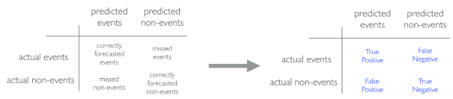
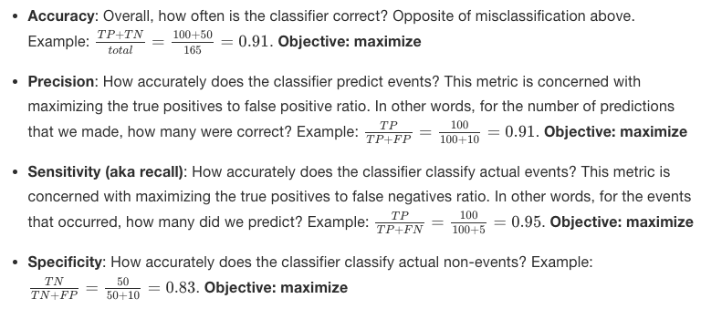
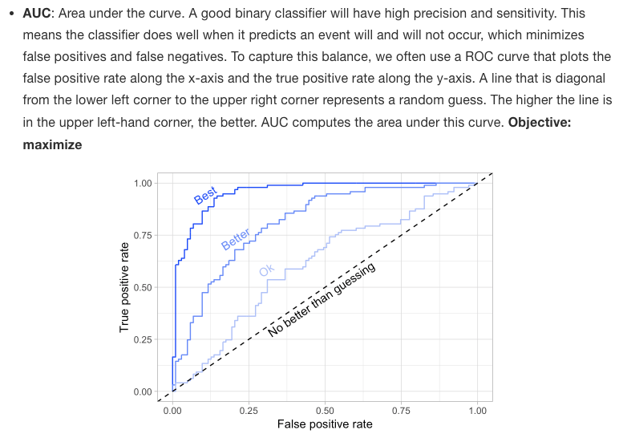
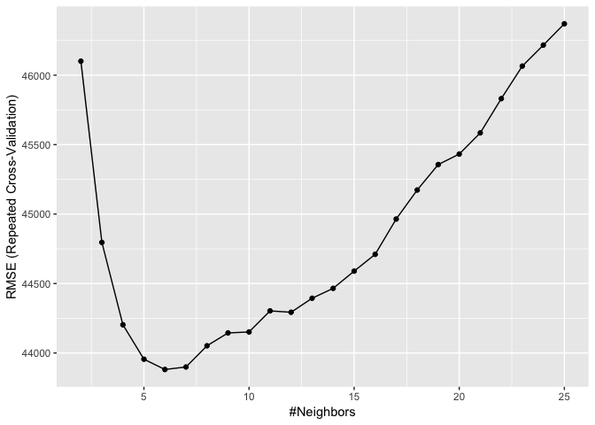

``` r
ames <- AmesHousing::make_ames()
ames.h2o <- as.h2o(ames)

churn <- rsample::attrition %>% 
  mutate_if(is.ordered, factor, ordered = FALSE)
churn.h2o <- as.h2o(churn)
```

Resampling methods
------------------

### k-fold cross validataion

k-fold cross-validation (aka k-fold CV) is a resampling method that
randomly divides the training data into k groups (aka folds) of
approximately equal size.

``` r
h2o.cv <- h2o.glm(
  x = c("Year_Sold", "Longitude", "Latitude"), 
  y = "Sale_Price", 
  training_frame = ames.h2o,
  nfolds = 10  # perform 10-fold CV
)
```

### Bootstrapping

A bootstrap sample is a random sample of the data taken with replacement

``` r
bootstraps(ames, times = 10)
```

    ## # Bootstrap sampling 
    ## # A tibble: 10 x 2
    ##    splits              id         
    ##    <list>              <chr>      
    ##  1 <split [2.9K/1.1K]> Bootstrap01
    ##  2 <split [2.9K/1.1K]> Bootstrap02
    ##  3 <split [2.9K/1.1K]> Bootstrap03
    ##  4 <split [2.9K/1.1K]> Bootstrap04
    ##  5 <split [2.9K/1.1K]> Bootstrap05
    ##  6 <split [2.9K/1.1K]> Bootstrap06
    ##  7 <split [2.9K/1.1K]> Bootstrap07
    ##  8 <split [2.9K/1.1K]> Bootstrap08
    ##  9 <split [2.9K/1K]>   Bootstrap09
    ## 10 <split [2.9K/1K]>   Bootstrap10

Bias variance trade-off
-----------------------

### Bias

Bias is the difference between the expected (or average) prediction of
our model and the correct value which we are trying to predict. It
measures how far off in general a model’s predictions are from the
correct value, which provides a sense of how well a model can conform to
the underlying structure of the data.

### Variance

Error due to variance is defined as the variability of a model
prediction for a given data point.

### Hyperparameter tuning

Hyperparameters (aka tuning parameters) are the “knobs to twiddle”6 to
control the complexity of machine learning algorithms and, therefore,
the bias-variance trade-off.

Model evaluation
----------------

### Regression models

-   **MSE**: Mean squared error is the average of the squared error The
    squared component results in larger errors having larger penalties.
    -   Objective: minimize
-   **RMSE**: Root mean squared error. This simply takes the square root
    of the MSE metric so that your error is in the same units as your
    response variable. If your response variable units are dollars, the
    units of MSE are dollars-squared, but the RMSE will be in dollars.
    -   Objective: minimize
-   **Deviance**: Short for mean residual deviance. In essence, it
    provides a degree to which a model explains the variation in a set
    of data when using maximum likelihood estimation. If the response
    variable distribution is Gaussian, then it will be approximately
    equal to MSE. When not, it usually gives a more useful estimate of
    error
    -   Objective: minimize
-   **MAE**: Mean absolute error. Similar to MSE but rather than
    squaring, it just takes the mean absolute difference between the
    actual and predicted values
    -   Objective: minimize
-   **RMSLE**: Root mean squared logarithmic error.
    -   Objective: minimize
-   **R^2**: This is a popular metric that represents the proportion of
    the variance in the dependent variable that is predictable from the
    independent variable(s).
    -   Objective: maximize

### Classification models

-   **Misclassification**: This is the overall error.
    -   Objective: minimize
-   **Mean per class error**: This is the average error rate for each
    class
    -   Objective: minimize
-   **MSE**: Mean squared error. Computes the distance from 1.0 to the
    probability suggested.
    -   Objective: minimize
-   **Cross-entropy (aka Log Loss or Deviance)**: Similar to MSE but it
    incorporates a log of the predicted probability multiplied by the
    true class
    -   Objective: minimize
-   **Gini index**: Mainly used with tree-based methods and commonly
    referred to as a measure of purity where a small value indicates
    that a node contains predominantly observations from a single class.
    -   Objective: minimize

 



### Exercise

``` r
set.seed(123)
split  <- initial_split(ames, prop = 0.7, strata = "Sale_Price")
ames_train  <- training(split)
ames_test   <- testing(split)
```

``` r
# create resampling method 
cv <- trainControl(
  method = "repeatedcv",
  number = 10, 
  repeats = 5
)


# create a hyperparameter grid search 
hyper_grid <- expand.grid(k = seq(2, 25, by = 1))

# fit knn model and perform grid search 
knn_fit <- train(
  Sale_Price ~., 
  data = ames_train,
  method = "knn",
  trControl = cv,
  tuneGrid = hyper_grid,
  metric = "RMSE"
)
# print model results
knn_fit
```

    ## k-Nearest Neighbors 
    ## 
    ## 2054 samples
    ##   80 predictor
    ## 
    ## No pre-processing
    ## Resampling: Cross-Validated (10 fold, repeated 5 times) 
    ## Summary of sample sizes: 1848, 1850, 1848, 1848, 1848, 1848, ... 
    ## Resampling results across tuning parameters:
    ## 
    ##   k   RMSE      Rsquared   MAE     
    ##    2  46100.84  0.6618945  30205.06
    ##    3  44795.95  0.6789376  29186.58
    ##    4  44203.37  0.6875495  28696.28
    ##    5  43955.23  0.6929491  28578.45
    ##    6  43881.20  0.6960556  28476.22
    ##    7  43899.20  0.6978741  28451.48
    ##    8  44051.92  0.6975777  28510.18
    ##    9  44144.37  0.6992237  28518.58
    ##   10  44151.47  0.7012776  28511.66
    ##   11  44303.16  0.7013299  28622.90
    ##   12  44293.22  0.7034353  28680.76
    ##   13  44394.05  0.7036137  28764.46
    ##   14  44465.34  0.7041550  28825.92
    ##   15  44589.31  0.7035993  28903.68
    ##   16  44710.25  0.7032248  28993.49
    ##   17  44964.24  0.7006974  29138.41
    ##   18  45173.35  0.6983529  29281.58
    ##   19  45356.63  0.6971599  29395.48
    ##   20  45431.99  0.6974316  29476.37
    ##   21  45584.65  0.6963996  29595.03
    ##   22  45831.18  0.6939451  29761.02
    ##   23  46065.43  0.6911839  29935.52
    ##   24  46216.44  0.6903087  30056.99
    ##   25  46370.20  0.6892005  30185.26
    ## 
    ## RMSE was used to select the optimal model using the smallest value.
    ## The final value used for the model was k = 6.

``` r
# plot cross validation results
ggplot(knn_fit)
```


