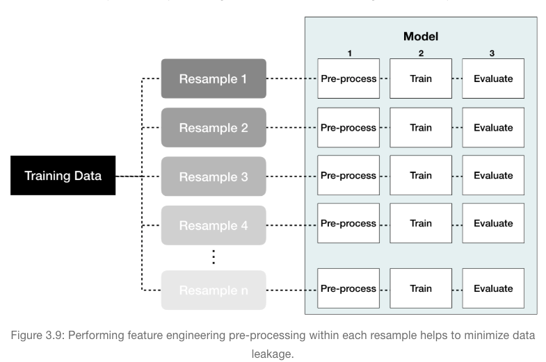

Target engineering
------------------

-   **Option 1**: normalize with a log transformation. This will
    transform most right skewed distributions to be approximately
    normal.

-   **Option 2**: use a Box Cox transformation. A Box Cox transformation
    is more flexible than (but also includes as a special case) the log
    transformation and will find an appropriate transformation from a
    family of power transforms that will transform the variable as close
    as possible to a normal distribution

Dealing with missingness
------------------------

### Visualizing missing values

``` r
sum(is.na(AmesHousing::ames_raw))
```

    ## [1] 13997

``` r
AmesHousing::ames_raw %>% 
  is.na() %>% 
  reshape2::melt() %>% 
  ggplot(aes(Var2, Var1, fill = value)) + 
  geom_raster() + 
  coord_flip() + 
  scale_y_continuous(NULL, expand = c(0,0)) + 
  xlab("Observation") +
  theme(axis.text.y  = element_text(size = 4))
```


``` r
AmesHousing::ames_raw %>% 
  filter(is.na(`Garage Type`)) %>% 
  select(`Garage Type`, `Garage Cars`, `Garage Area`)
```

    ## # A tibble: 157 x 3
    ##    `Garage Type` `Garage Cars` `Garage Area`
    ##    <chr>                 <int>         <int>
    ##  1 <NA>                      0             0
    ##  2 <NA>                      0             0
    ##  3 <NA>                      0             0
    ##  4 <NA>                      0             0
    ##  5 <NA>                      0             0
    ##  6 <NA>                      0             0
    ##  7 <NA>                      0             0
    ##  8 <NA>                      0             0
    ##  9 <NA>                      0             0
    ## 10 <NA>                      0             0
    ## # … with 147 more rows

``` r
vis_miss(AmesHousing::ames_raw, cluster = TRUE)
```


### Imputation

Imputation is the process of replacing a missing value with a
substituted, “best guess” value. Imputation should be one of the first
feature engineering steps yo take as it will effect any downstream
pre-processing

-   **Estimated statistic**
-   **K-nearest neighbor**: K-nearest neighbor (KNN) imputes values by
    identifying observations with missing values, then identifying other
    observations that are most similar based on the other available
    features, and using the values from these nearest neighbor
    observations to impute missing values.
-   **Tree-based**

Numeric feature engineering
---------------------------

-   **Skewness**: When normalizing many variables, its best to use the
    **Box-Cox** (when feature values are strictly positive) or
    **Yeo-Johnson** (when feature values are not strictly positive)
    procedures as these methods will identify if a transformation is
    required and what the optimal transformation will be.

``` r
ames <- AmesHousing::make_ames()
split_ames  <- rsample::initial_split(ames, prop = 0.7, strata = "Sale_Price")
ames_train  <- training(split_ames)
ames_test   <- testing(split_ames)


recipe(Sale_Price ~., data = ames_train) %>% 
  step_YeoJohnson(all_numeric())
```

    ## Data Recipe
    ## 
    ## Inputs:
    ## 
    ##       role #variables
    ##    outcome          1
    ##  predictor         80
    ## 
    ## Operations:
    ## 
    ## Yeo-Johnson transformation on all_numeric()

-   **Standardization**: Some packages (e.g., `glmnet`, and `caret`)
    have built-in options to standardize and some do not (e.g., `keras`
    for neural networks)

Categorical feature engineering
-------------------------------

-   **Lumping**: Sometimes features will contain levels that have very
    few observations. Sometimes we can benefit from collapsing, or
    “lumping” these into a lesser number of categories. In the above
    examples, we may want to collapse all levels that are observed in
    less than 10% of the training sample into an “other” category. We
    can use `step_other()` to do so

``` r
count(ames_train, Neighborhood) %>% arrange(n)
```

    ## # A tibble: 28 x 2
    ##    Neighborhood            n
    ##    <fct>               <int>
    ##  1 Landmark                1
    ##  2 Green_Hills             2
    ##  3 Greens                  5
    ##  4 Blueste                 8
    ##  5 Briardale              15
    ##  6 Northpark_Villa        15
    ##  7 Veenker                17
    ##  8 Bloomington_Heights    21
    ##  9 Meadow_Village         29
    ## 10 Clear_Creek            31
    ## # … with 18 more rows

``` r
# lump levels for two features
lumping <- recipe(Sale_Price ~ ., data = ames_train) %>%
  step_other(Neighborhood, threshold = .01, other = "other") %>%
  step_other(Screen_Porch, threshold = .1, other = ">0")


apply_2_training <- prep(lumping, training = ames_train) %>%
  bake(ames_train)

count(apply_2_training, Neighborhood) %>% arrange(n)
```

    ## # A tibble: 22 x 2
    ##    Neighborhood                                n
    ##    <fct>                                   <int>
    ##  1 Bloomington_Heights                        21
    ##  2 Meadow_Village                             29
    ##  3 Clear_Creek                                31
    ##  4 South_and_West_of_Iowa_State_University    32
    ##  5 Stone_Brook                                34
    ##  6 Northridge                                 50
    ##  7 Timberland                                 54
    ##  8 other                                      63
    ##  9 Iowa_DOT_and_Rail_Road                     66
    ## 10 Crawford                                   76
    ## # … with 12 more rows

``` r
count(apply_2_training, Screen_Porch) %>% arrange(n)
```

    ## # A tibble: 2 x 2
    ##   Screen_Porch     n
    ##   <fct>        <int>
    ## 1 >0             185
    ## 2 0             1869

-   **One-hot & dummy encoding**: Many models require that all predictor
    variables be numeric. Consequently, we need to intelligently
    transform any categorical variables into numeric representations so
    that these algorithms can compute. Some packages automate this
    process (e.g., `h2o` and `caret`) while others do not (e.g.,
    `glmnet` and `keras`). There are many ways to re, say,code
    categorical variables as numeric (e.g., one-hot, ordinal, binary,
    sum, and Helmert).
    -   one-hot encoding, where we transpose our categorical variables
        so that each level of the feature is represented as a boolean
        value
    -   we can create full-rank one-hot encoding by dropping one of the
        levels (level a has been dropped). This is referred to as dummy
        encoding.

``` r
recipe(Sale_Price ~., data = ames_train) %>% 
  step_dummy(all_nominal(), one_hot = TRUE)
```

    ## Data Recipe
    ## 
    ## Inputs:
    ## 
    ##       role #variables
    ##    outcome          1
    ##  predictor         80
    ## 
    ## Operations:
    ## 
    ## Dummy variables from all_nominal()

-   **Label encoding**: Label encoding is a pure numeric conversion of
    the levels of a categorical variable. If a categorical variable is a
    factor and it has pre-specified levels then the numeric conversion
    will be in level order. If no levels are specified, the encoding
    will be based on alphabetical order.

``` r
#label encoded 
recipe(Sale_Price ~., data = ames_train) %>% 
  step_integer(MS_SubClass) %>% 
  prep(ames_train) %>% 
  bake(ames_train) %>% 
  count(MS_SubClass)
```

    ## # A tibble: 16 x 2
    ##    MS_SubClass     n
    ##          <dbl> <int>
    ##  1           1   773
    ##  2           2    95
    ##  3           3     6
    ##  4           4    13
    ##  5           5   199
    ##  6           6   397
    ##  7           7    82
    ##  8           8    17
    ##  9           9    81
    ## 10          10    35
    ## 11          11    77
    ## 12          12   144
    ## 13          13     1
    ## 14          14    74
    ## 15          15    15
    ## 16          16    45

-   **Alternatives**: There are several alternative categorical
    encodings that are implemented in various R machine learning engines
    and are worth exploring. For example, target encoding is the process
    of replacing a categorical value with the mean (regression) or
    proportion (classification) of the target variable.

Dimension reduction
-------------------

``` r
recipe(Sale_Price ~., data = ames_train) %>% 
  step_center(all_numeric()) %>% 
  step_scale(all_numeric()) %>% 
  step_pca(all_numeric(), threshold = .95)
```

    ## Data Recipe
    ## 
    ## Inputs:
    ## 
    ##       role #variables
    ##    outcome          1
    ##  predictor         80
    ## 
    ## Operations:
    ## 
    ## Centering for all_numeric()
    ## Scaling for all_numeric()
    ## PCA extraction with all_numeric()

Proper implementation
---------------------

### Sequential steps

-   If using a log or `Box-Cox` transformation, don’t center the data
    first or do any operations that might make the data non-positive.
    Alternatively, use the `Yeo-Johnson` transformation so you don’t
    have to worry about this.
-   `One-hot` or `dummy` encoding typically results in sparse data which
    many algorithms can operate efficiently on. If you standardize
    sparse data you will create dense data and you loose the
    computational efficiency. Consequently, its often preferred to
    standardize your numeric features and then one-hot/dummy encode.
-   If you are `lumping` infrequently categories together, do so before
    one-hot/dummy encoding.
-   Although you can perform dimension reduction procedures on
    categorical features, it is common to primarily do so on numeric
    features when doing so for feature engineering purposes.

Suggested order of potential steps:

-   Filter out zero or near-zero variance features.
-   Perform imputation if required.
-   Normalize to resolve numeric feature skewness.
-   Standardize (center and scale) numeric features.
-   Perform dimension reduction (e.g., PCA) on numeric features.
-   One-hot or dummy encode categorical features.

### Data leakage

Data leakage is when information from outside the training data set is
used to create the model. Data leakage often occurs during the data
preprocessing period. To minimize this, feature engineering should be
done in isolation of each resampling iteration. Recall that resampling
allows us to estimate the generalizable prediction error. Therefore, we
should apply our feature engineering blueprint to each resample
independently



Exercise
--------

``` r
#Putting the process together
blueprint <- recipe(Sale_Price ~ ., data = ames_train) %>%
  step_nzv(all_nominal()) %>%
  step_integer(matches("Qual|Cond|QC|Qu")) %>%
  step_center(all_numeric(), -all_outcomes()) %>%
  step_scale(all_numeric(), -all_outcomes()) %>%
  step_dummy(all_nominal(), -all_outcomes(), one_hot = TRUE)
```

``` r
# create a resampling method
cv <- trainControl(
  method = "repeatedcv", 
  number = 10, 
  repeats = 5
  )

# create a hyperparameter grid search
hyper_grid <- expand.grid(k = seq(2, 25, by = 1))

# fit knn model and perform grid search
knn_fit2 <- train(
  blueprint, 
  data = ames_train, 
  method = "knn", 
  trControl = cv, 
  tuneGrid = hyper_grid,
  metric = "RMSE"
  )
```

``` r
knn_fit2
```

    ## k-Nearest Neighbors 
    ## 
    ## 2054 samples
    ##   80 predictor
    ## 
    ## Recipe steps: nzv, integer, center, scale, dummy 
    ## Resampling: Cross-Validated (10 fold, repeated 5 times) 
    ## Summary of sample sizes: 1850, 1848, 1849, 1848, 1849, 1849, ... 
    ## Resampling results across tuning parameters:
    ## 
    ##   k   RMSE      Rsquared   MAE     
    ##    2  35053.04  0.8063747  22408.76
    ##    3  34384.47  0.8156885  21706.53
    ##    4  33489.36  0.8267338  21022.83
    ##    5  33281.59  0.8313709  20873.43
    ##    6  33190.30  0.8340327  20699.94
    ##    7  33037.32  0.8367436  20632.65
    ##    8  33002.78  0.8384374  20593.81
    ##    9  32964.68  0.8399506  20599.16
    ##   10  33029.71  0.8407511  20661.58
    ##   11  33064.36  0.8416085  20733.58
    ##   12  33209.11  0.8409620  20835.34
    ##   13  33298.15  0.8409283  20892.39
    ##   14  33372.06  0.8405507  20957.10
    ##   15  33495.61  0.8397517  21040.75
    ##   16  33596.58  0.8392703  21108.58
    ##   17  33679.63  0.8390784  21172.96
    ##   18  33781.67  0.8385696  21222.51
    ##   19  33910.63  0.8377111  21319.81
    ##   20  34044.98  0.8364103  21398.36
    ##   21  34132.39  0.8358244  21461.79
    ##   22  34200.77  0.8355018  21498.96
    ##   23  34278.56  0.8351867  21530.44
    ##   24  34349.74  0.8348476  21552.05
    ##   25  34428.70  0.8345057  21590.29
    ## 
    ## RMSE was used to select the optimal model using the smallest value.
    ## The final value used for the model was k = 9.

``` r
plot(knn_fit2)
```


