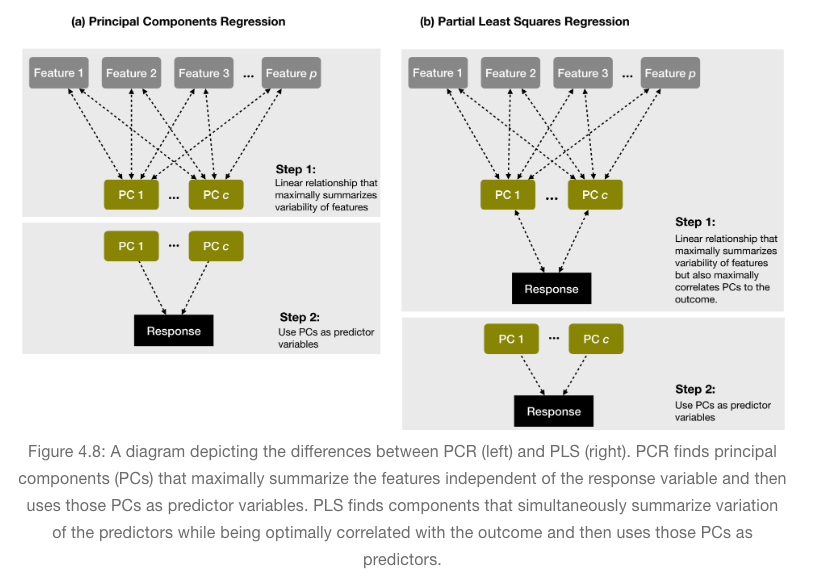

```{r setup, include=FALSE}
knitr::opts_chunk$set(echo = TRUE)
library(caret)    # for cross-validation and model training functions
library(dplyr)    # for data manipulation
library(ggplot2)  # for awesome graphics
library(vip)      # for variable importance plots
library(rsample)
```


### Linear regression 

```{r}
ames <- AmesHousing::make_ames()
split_ames  <- rsample::initial_split(ames, prop = 0.7, strata = "Sale_Price")
ames_train  <- training(split_ames)
ames_test   <- testing(split_ames)

model1 <- lm(Sale_Price ~ Gr_Liv_Area, data = ames_train)

sigma(model1)    # RMSE
sigma(model1)^2  # MSE

confint(model1, level = 0.95)
```

```{r}
model2 <- update(model1, . ~ . + Year_Built)
```


```{r}
model3 <- lm(Sale_Price ~., data = ames_train) 
# print estimated coefficients in a tidy data frame
broom::tidy(model3)  
```

### Assessing model accuracy

```{r message=FALSE, warning=FALSE}
set.seed(123)
cv_model1 <- train(
  form = Sale_Price ~ Gr_Liv_Area, 
  data = ames_train, 
  method = "lm",
  trControl = trainControl(method = "cv", number = 10)
)

set.seed(123)
cv_model2 <- train(
  Sale_Price ~ Gr_Liv_Area + Year_Built, 
  data = ames_train, 
  method = "lm",
  trControl = trainControl(method = "cv", number = 10)
)


set.seed(123)
cv_model3 <- train(
  Sale_Price ~ ., 
  data = ames_train, 
  method = "lm",
  trControl = trainControl(method = "cv", number = 10)
)


# Extract out of sample performance measures
summary(
  resamples(list(
    model1 = cv_model1, 
    model2 = cv_model2, 
    model3 = cv_model3
  )))

```

### Model concerns

- **Linear relationship**: Linear regression assumes a linear relationship between the predictor and the response variable.

- **Constant variance among residuals**: Linear regression assumes the variance among error terms are constant (this assumption is referred to as homoscedasticity). If the error variance is not constant, the p-values and confidence intervals for the coefficients will be invalid.

```{r}
df1 <- broom::augment(cv_model1$finalModel, data = ames_train)

p1 <- ggplot(df1, aes(.fitted, .resid)) + 
  geom_point(size = 1, alpha = .4) +
  xlab("Predicted values") +
  ylab("Residuals") +
  ggtitle("Model 1", subtitle = "Sale_Price ~ Gr_Liv_Area")

df2 <- broom::augment(cv_model3$finalModel, data = ames_train)

p2 <- ggplot(df2, aes(.fitted, .resid)) + 
  geom_point(size = 1, alpha = .4)  +
  xlab("Predicted values") +
  ylab("Residuals") +
  ggtitle("Model 3", subtitle = "Sale_Price ~ .")

gridExtra::grid.arrange(p1, p2, nrow = 1)

```


- **No autocorrelation**: Linear regression assumes the errors are independent and uncorrelated. If in fact, there is correlation among the errors, then the estimated standard errors of the coefficients will be biased leading to prediction intervals being narrower than they should be

```{r}
df1 <- mutate(df1, id = row_number())
df2 <- mutate(df2, id = row_number())

p1 <- ggplot(df1, aes(id, .resid)) + 
  geom_point(size = 1, alpha = .4) +
  xlab("Row ID") +
  ylab("Residuals") +
  ggtitle("Model 1",
    subtitle = "Correlated residuals.")

p2 <- ggplot(df2, aes(id, .resid)) + 
  geom_point(size = 1, alpha = .4) +
  xlab("Row ID") +
  ylab("Residuals") +
  ggtitle("Model 3",
    subtitle = "Uncorrelated residuals.")

gridExtra::grid.arrange(p1, p2, nrow = 1)
```


- **More observations than predictors**: Although not an issue with the Ames housing data, when the number of features exceeds the number of observations, the OLS estimates are not obtainable. To resolve this issue an analyst can remove variables one-at-a-time until p < n. Although pre-processing tools can be used to guide this manual approach, it can be cumbersome and prone to errors. 

- **No or little multicollinearity**: Collinearity refers to the situation in which two or more predictor variables are closely related to one another. The presence of collinearity can pose problems in the OLS, since it can be difficult to separate out the individual effects of collinear variables on the response. 


### Principal component regression (PCR)


```{r}
# perform 10-fold cross validation on a PCR model tuning the number of
# principal components to use as predictors from 1-20
set.seed(123)
cv_model_pcr <- train(
  Sale_Price ~ ., 
  data = ames_train, 
  method = "pcr",
  trControl = trainControl(method = "cv", number = 10),
  preProcess = c("zv", "center", "scale"),
  tuneLength = 20
  )

# model with lowest RMSE
cv_model_pcr$bestTune
##    ncomp
## 17    17

# plot cross-validated RMSE
ggplot(cv_model_pcr)
```


### Partial least squares (PLS)


```{r}
# perform 10-fold cross validation on a PLS model tuning the number of
# principal components to use as predictors from 1-20
set.seed(123)
cv_model_pls <- train(
  Sale_Price ~ ., 
  data = ames_train, 
  method = "pls",
  trControl = trainControl(method = "cv", number = 10),
  preProcess = c("zv", "center", "scale"),
  tuneLength = 20
)

# model with lowest RMSE
cv_model_pls$bestTune
##    ncomp
## 10    10

# plot cross-validated RMSE
ggplot(cv_model_pls)
```

### Feature interpretation


Once we’ve found the model that minimizes the predictive accuracy, our next goal is to interpret the model structure.


```{r}
vip(cv_model_pls, num_features = 20, method = "model")
```


