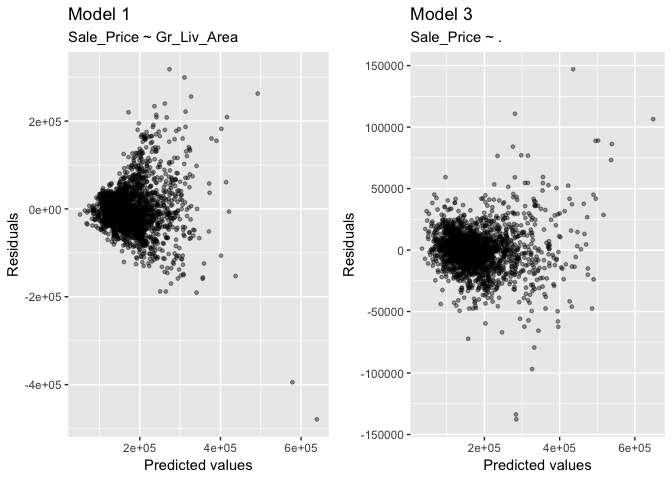
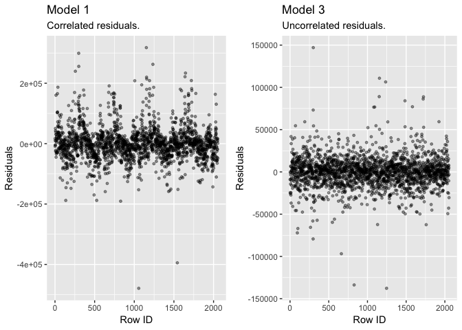
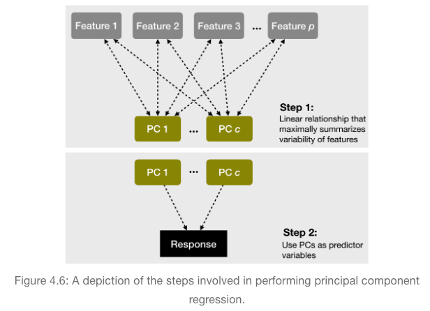
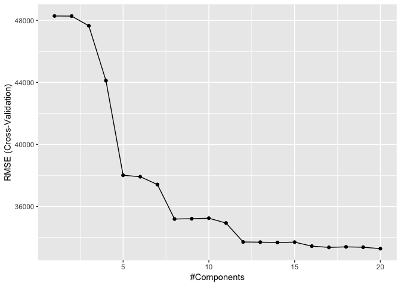
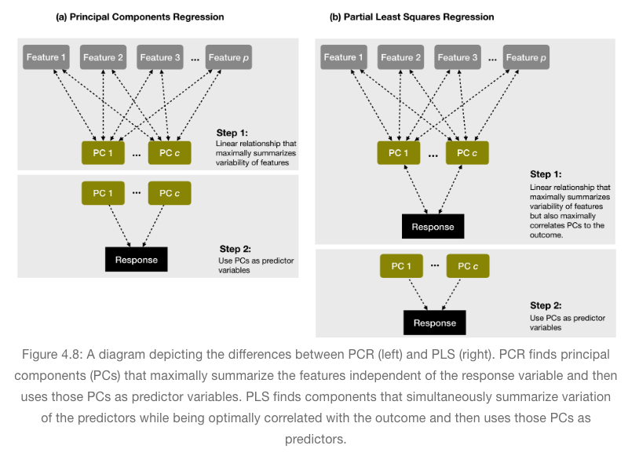
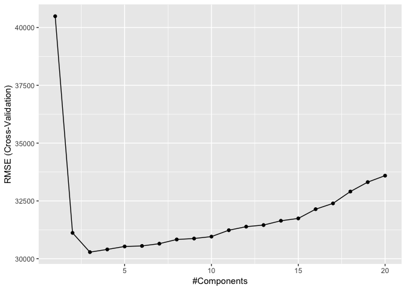
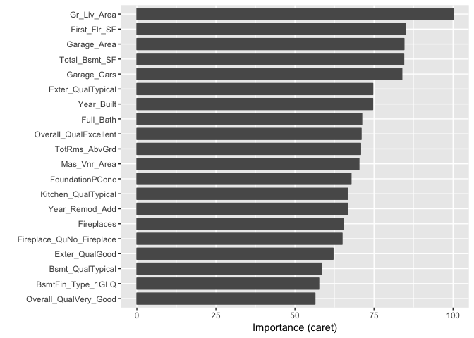

### Linear regression

``` r
ames <- AmesHousing::make_ames()
split_ames  <- rsample::initial_split(ames, prop = 0.7, strata = "Sale_Price")
ames_train  <- training(split_ames)
ames_test   <- testing(split_ames)

model1 <- lm(Sale_Price ~ Gr_Liv_Area, data = ames_train)

sigma(model1)    # RMSE
```

    ## [1] 55856.18

``` r
sigma(model1)^2  # MSE
```

    ## [1] 3119912595

``` r
confint(model1, level = 0.95)
```

    ##                 2.5 %     97.5 %
    ## (Intercept) 7500.7199 22561.9985
    ## Gr_Liv_Area  105.8347   115.3523

``` r
model2 <- update(model1, . ~ . + Year_Built)
```

``` r
model3 <- lm(Sale_Price ~., data = ames_train) 
# print estimated coefficients in a tidy data frame
broom::tidy(model3)  
```

    ## # A tibble: 292 x 5
    ##    term                                estimate std.error statistic p.value
    ##    <chr>                                  <dbl>     <dbl>     <dbl>   <dbl>
    ##  1 (Intercept)                          -7.86e6 10334127.    -0.761   0.447
    ##  2 MS_SubClassOne_Story_1945_and_Older   2.62e3     3466.     0.755   0.450
    ##  3 MS_SubClassOne_Story_with_Finished…   6.60e3     9774.     0.676   0.499
    ##  4 MS_SubClassOne_and_Half_Story_Unfi…   2.13e4    17985.     1.19    0.236
    ##  5 MS_SubClassOne_and_Half_Story_Fini…   6.62e3     5949.     1.11    0.266
    ##  6 MS_SubClassTwo_Story_1946_and_Newer   9.05e2     5468.     0.165   0.869
    ##  7 MS_SubClassTwo_Story_1945_and_Older   6.10e3     6003.     1.02    0.310
    ##  8 MS_SubClassTwo_and_Half_Story_All_…   1.56e4    11110.     1.41    0.160
    ##  9 MS_SubClassSplit_or_Multilevel       -7.39e3    10683.    -0.692   0.489
    ## 10 MS_SubClassSplit_Foyer               -2.43e3     7196.    -0.337   0.736
    ## # … with 282 more rows

### Assessing model accuracy

``` r
set.seed(123)
cv_model1 <- train(
  form = Sale_Price ~ Gr_Liv_Area, 
  data = ames_train, 
  method = "lm",
  trControl = trainControl(method = "cv", number = 10)
)

set.seed(123)
cv_model2 <- train(
  Sale_Price ~ Gr_Liv_Area + Year_Built, 
  data = ames_train, 
  method = "lm",
  trControl = trainControl(method = "cv", number = 10)
)


set.seed(123)
cv_model3 <- train(
  Sale_Price ~ ., 
  data = ames_train, 
  method = "lm",
  trControl = trainControl(method = "cv", number = 10)
)


# Extract out of sample performance measures
summary(
  resamples(list(
    model1 = cv_model1, 
    model2 = cv_model2, 
    model3 = cv_model3
  )))
```

    ## 
    ## Call:
    ## summary.resamples(object = resamples(list(model1 = cv_model1, model2
    ##  = cv_model2, model3 = cv_model3)))
    ## 
    ## Models: model1, model2, model3 
    ## Number of resamples: 10 
    ## 
    ## MAE 
    ##            Min.  1st Qu.   Median     Mean  3rd Qu.     Max. NA's
    ## model1 35902.65 37147.79 37803.32 38238.56 39057.66 42363.02    0
    ## model2 28042.14 29558.52 31572.36 31322.08 32053.84 37152.68    0
    ## model3 13611.88 15314.03 16195.70 17284.20 18833.47 24643.03    0
    ## 
    ## RMSE 
    ##            Min.  1st Qu.   Median     Mean  3rd Qu.     Max. NA's
    ## model1 50923.02 52501.17 53778.84 55682.20 56720.76 67961.93    0
    ## model2 39178.61 42104.58 44002.37 45810.59 46820.73 60586.10    0
    ## model3 21409.94 22672.04 23876.78 37456.71 50990.65 91417.73    0
    ## 
    ## Rsquared 
    ##             Min.   1st Qu.    Median      Mean   3rd Qu.      Max. NA's
    ## model1 0.3743126 0.4583443 0.5323077 0.5084245 0.5522466 0.6075470    0
    ## model2 0.5455330 0.6314935 0.7044421 0.6673091 0.7099419 0.7249265    0
    ## model3 0.3783809 0.7038408 0.9060871 0.7995702 0.9184556 0.9290006    0

### Model concerns

-   **Linear relationship**: Linear regression assumes a linear
    relationship between the predictor and the response variable.

-   **Constant variance among residuals**: Linear regression assumes the
    variance among error terms are constant (this assumption is referred
    to as homoscedasticity). If the error variance is not constant, the
    p-values and confidence intervals for the coefficients will be
    invalid.

``` r
df1 <- broom::augment(cv_model1$finalModel, data = ames_train)

p1 <- ggplot(df1, aes(.fitted, .resid)) + 
  geom_point(size = 1, alpha = .4) +
  xlab("Predicted values") +
  ylab("Residuals") +
  ggtitle("Model 1", subtitle = "Sale_Price ~ Gr_Liv_Area")

df2 <- broom::augment(cv_model3$finalModel, data = ames_train)

p2 <- ggplot(df2, aes(.fitted, .resid)) + 
  geom_point(size = 1, alpha = .4)  +
  xlab("Predicted values") +
  ylab("Residuals") +
  ggtitle("Model 3", subtitle = "Sale_Price ~ .")

gridExtra::grid.arrange(p1, p2, nrow = 1)
```



-   **No autocorrelation**: Linear regression assumes the errors are
    independent and uncorrelated. If in fact, there is correlation among
    the errors, then the estimated standard errors of the coefficients
    will be biased leading to prediction intervals being narrower than
    they should be

``` r
df1 <- mutate(df1, id = row_number())
df2 <- mutate(df2, id = row_number())

p1 <- ggplot(df1, aes(id, .resid)) + 
  geom_point(size = 1, alpha = .4) +
  xlab("Row ID") +
  ylab("Residuals") +
  ggtitle("Model 1",
    subtitle = "Correlated residuals.")

p2 <- ggplot(df2, aes(id, .resid)) + 
  geom_point(size = 1, alpha = .4) +
  xlab("Row ID") +
  ylab("Residuals") +
  ggtitle("Model 3",
    subtitle = "Uncorrelated residuals.")

gridExtra::grid.arrange(p1, p2, nrow = 1)
```



-   **More observations than predictors**: Although not an issue with
    the Ames housing data, when the number of features exceeds the
    number of observations, the OLS estimates are not obtainable. To
    resolve this issue an analyst can remove variables one-at-a-time
    until p \< n. Although pre-processing tools can be used to guide
    this manual approach, it can be cumbersome and prone to errors.

-   **No or little multicollinearity**: Collinearity refers to the
    situation in which two or more predictor variables are closely
    related to one another. The presence of collinearity can pose
    problems in the OLS, since it can be difficult to separate out the
    individual effects of collinear variables on the response.

### Principal component regression (PCR)



``` r
# perform 10-fold cross validation on a PCR model tuning the number of
# principal components to use as predictors from 1-20
set.seed(123)
cv_model_pcr <- train(
  Sale_Price ~ ., 
  data = ames_train, 
  method = "pcr",
  trControl = trainControl(method = "cv", number = 10),
  preProcess = c("zv", "center", "scale"),
  tuneLength = 20
  )

# model with lowest RMSE
cv_model_pcr$bestTune
```

    ##    ncomp
    ## 20    20

``` r
##    ncomp
## 17    17

# plot cross-validated RMSE
ggplot(cv_model_pcr)
```



### Partial least squares (PLS)



``` r
# perform 10-fold cross validation on a PLS model tuning the number of
# principal components to use as predictors from 1-20
set.seed(123)
cv_model_pls <- train(
  Sale_Price ~ ., 
  data = ames_train, 
  method = "pls",
  trControl = trainControl(method = "cv", number = 10),
  preProcess = c("zv", "center", "scale"),
  tuneLength = 20
)

# model with lowest RMSE
cv_model_pls$bestTune
```

    ##   ncomp
    ## 3     3

``` r
##    ncomp
## 10    10

# plot cross-validated RMSE
ggplot(cv_model_pls)
```



### Feature interpretation

Once we’ve found the model that minimizes the predictive accuracy, our
next goal is to interpret the model structure.

``` r
vip(cv_model_pls, num_features = 20, method = "model")
```

    ## 
    ## Attaching package: 'pls'

    ## The following object is masked from 'package:caret':
    ## 
    ##     R2

    ## The following object is masked from 'package:stats':
    ## 
    ##     loadings


