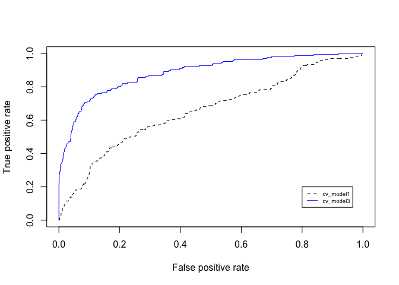
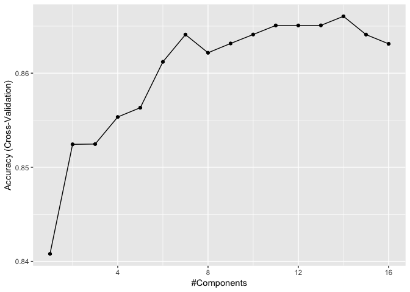
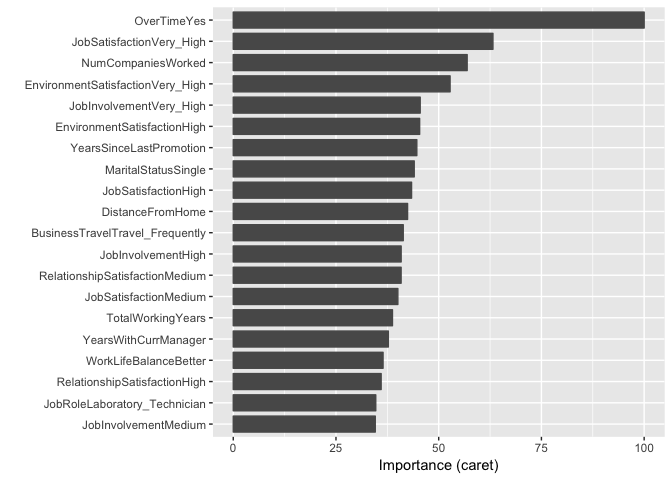

### Logistic Regression

``` r
df <- attrition %>% mutate_if(is.ordered, factor, ordered = FALSE)

# Create training (70%) and test (30%) sets for the rsample::attrition data.
set.seed(123)  # for reproducibility
churn_split <- initial_split(df, prop = .7, strata = "Attrition")
churn_train <- training(churn_split)
churn_test  <- testing(churn_split)
```

``` r
model1 <- glm(Attrition ~ MonthlyIncome, family = "binomial", data = churn_train)
model2 <- glm(Attrition ~ OverTime, family = "binomial", data = churn_train)
```

``` r
tidy(model1)
```

    ## # A tibble: 2 x 5
    ##   term           estimate std.error statistic  p.value
    ##   <chr>             <dbl>     <dbl>     <dbl>    <dbl>
    ## 1 (Intercept)   -0.984    0.152         -6.47 9.62e-11
    ## 2 MonthlyIncome -0.000114 0.0000244     -4.69 2.74e- 6

``` r
tidy(model2)
```

    ## # A tibble: 2 x 5
    ##   term        estimate std.error statistic  p.value
    ##   <chr>          <dbl>     <dbl>     <dbl>    <dbl>
    ## 1 (Intercept)    -2.14     0.120    -17.9  2.21e-71
    ## 2 OverTimeYes     1.31     0.175      7.47 8.03e-14

``` r
# convert to odds
exp(coef(model1))
```

    ##   (Intercept) MonthlyIncome 
    ##     0.3739904     0.9998855

``` r
exp(coef(model2))
```

    ## (Intercept) OverTimeYes 
    ##   0.1178248   3.6973851

``` r
# convert to probability
exp(coef(model1)) / (1 + exp(coef(model1)))
```

    ##   (Intercept) MonthlyIncome 
    ##     0.2721929     0.4999714

``` r
exp(coef(model2)) / (1 + exp(coef(model2)))
```

    ## (Intercept) OverTimeYes 
    ##   0.1054054   0.7871156

``` r
confint(model1)
```

    ## Waiting for profiling to be done...

    ##                       2.5 %        97.5 %
    ## (Intercept)   -1.2812811971 -6.848677e-01
    ## MonthlyIncome -0.0001648285 -6.889915e-05

``` r
confint(model2)
```

    ## Waiting for profiling to be done...

    ##                  2.5 %    97.5 %
    ## (Intercept) -2.3807720 -1.910857
    ## OverTimeYes  0.9652939  1.652362

``` r
model3 <- glm(Attrition ~ MonthlyIncome + OverTime, family = "binomial", data = churn_train)
tidy(model3)
```

    ## # A tibble: 3 x 5
    ##   term           estimate std.error statistic  p.value
    ##   <chr>             <dbl>     <dbl>     <dbl>    <dbl>
    ## 1 (Intercept)   -1.44     0.173         -8.32 9.00e-17
    ## 2 MonthlyIncome -0.000124 0.0000254     -4.88 1.06e- 6
    ## 3 OverTimeYes    1.36     0.179          7.61 2.75e-14

### Assessing model accuracy

``` r
set.seed(123)
cv_model1 <- train(
  Attrition ~ MonthlyIncome, 
  data = churn_train, 
  method = "glm",
  family = "binomial",
  trControl = trainControl(method = "cv", number = 10)
)


set.seed(123)
cv_model2 <- train(
  Attrition ~ MonthlyIncome + OverTime, 
  data = churn_train, 
  method = "glm",
  family = "binomial",
  trControl = trainControl(method = "cv", number = 10)
)

set.seed(123)
cv_model3 <- train(
  Attrition ~ ., 
  data = churn_train, 
  method = "glm",
  family = "binomial",
  trControl = trainControl(method = "cv", number = 10)
)

# extract out of sample performance measures
summary(
  resamples(
    list(
      model1 = cv_model1, 
      model2 = cv_model2, 
      model3 = cv_model3
    )
  )
)$statistics$Accuracy
```

    ##             Min.   1st Qu.    Median      Mean   3rd Qu.      Max. NA's
    ## model1 0.8349515 0.8353482 0.8365385 0.8388542 0.8431373 0.8446602    0
    ## model2 0.8349515 0.8353482 0.8365385 0.8388542 0.8431373 0.8446602    0
    ## model3 0.8058252 0.8389423 0.8585570 0.8631848 0.8949172 0.9134615    0

``` r
# predict class
pred_class <- predict(cv_model3, churn_train)

# create confusion matrix
confusionMatrix(
  data = relevel(pred_class, ref = "Yes"),
  reference = relevel(churn_train$Attrition, ref = "Yes")
)
```

    ## Confusion Matrix and Statistics
    ## 
    ##           Reference
    ## Prediction Yes  No
    ##        Yes  79  33
    ##        No   87 831
    ##                                           
    ##                Accuracy : 0.8835          
    ##                  95% CI : (0.8623, 0.9025)
    ##     No Information Rate : 0.8388          
    ##     P-Value [Acc > NIR] : 3.051e-05       
    ##                                           
    ##                   Kappa : 0.5039          
    ##                                           
    ##  Mcnemar's Test P-Value : 1.310e-06       
    ##                                           
    ##             Sensitivity : 0.4759          
    ##             Specificity : 0.9618          
    ##          Pos Pred Value : 0.7054          
    ##          Neg Pred Value : 0.9052          
    ##              Prevalence : 0.1612          
    ##          Detection Rate : 0.0767          
    ##    Detection Prevalence : 0.1087          
    ##       Balanced Accuracy : 0.7189          
    ##                                           
    ##        'Positive' Class : Yes             
    ## 

``` r
library(ROCR)
```

    ## Loading required package: gplots

    ## 
    ## Attaching package: 'gplots'

    ## The following object is masked from 'package:stats':
    ## 
    ##     lowess

``` r
# create predicted probabilities
m1_prob <- predict(cv_model1, churn_train, type = "prob")$Yes
m3_prob <- predict(cv_model3, churn_train, type = "prob")$Yes

# compute AUC metrics for cv_model1 and cv_model3
perf1 <- prediction(m1_prob, churn_train$Attrition) %>%
  performance(measure = "tpr", x.measure = "fpr")

perf2 <- prediction(m3_prob, churn_train$Attrition) %>%
  performance(measure = "tpr", x.measure = "fpr")

# plot both ROC curves for cv_model1 and cv_model3
plot(perf1, col = "black", lty = 2)
plot(perf2, add = TRUE, col = "blue")

legend(.8, .2, legend = c("cv_model1", "cv_model3"),
       col = c("black", "blue"), lty = 2:1, cex = 0.6)
```



``` r
# perform 10-fold cross validation on a PLS model tuning the number of
# principal components to use as predictors from 1-20
set.seed(123)
cv_model_pls <- train(
  Attrition ~ ., 
  data = churn_train, 
  method = "pls",
  family = "binomial",
  trControl = trainControl(method = "cv", number = 10),
  preProcess = c("zv", "center", "scale"),
  tuneLength = 16
  )

# model with lowest RMSE
cv_model_pls$bestTune
```

    ##    ncomp
    ## 14    14

``` r
##    ncomp
## 14    14

# plot cross-validated RMSE
ggplot(cv_model_pls)
```



### Feature interpretation

``` r
vip(cv_model3, num_features = 20)
```


